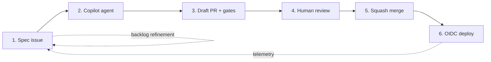

# The agentic SDLC loop

This is the loop the starter pack implements. Every primitive in
`.github/`, every CI/CD workflow under `.github/workflows/`, and every
infra resource under `infra/` exists to support **one** of the steps below.

## Step-by-step

### 1 — Spec issue

A spec issue captures **intent + acceptance criteria + non-goals + hints**.
Use the template at
[`.github/ISSUE_TEMPLATE/spec.yml`](../.github/ISSUE_TEMPLATE/spec.yml);
it has fields explicitly designed to give the agent enough context to
produce a useful PR on the first attempt.

A good spec issue:

- States the **outcome** (not the implementation)
- Names the **files / modules likely to change**
- Lists explicit **non-goals** so the agent doesn't drift
- Pins to relevant docs (e.g. links to
  [`.github/copilot-instructions.md`](../.github/copilot-instructions.md))

### 2 — Copilot agent picks it up

Two paths:

- **Cloud agent.** Assign the issue to `@copilot` (or use
  `.github/workflows/copilot-auto-assign.yml`, opt-in). The cloud agent
  runtime reads `.github/workflows/copilot-setup-steps.yml` to provision
  its environment, then opens a draft PR on a `agent/<issue>-<desc>`
  branch.
- **In-editor.** A developer working with Copilot in VS Code uses the
  same `.github/copilot-instructions.md` + path-scoped instructions
  (`.github/instructions/*.instructions.md`).

Either way the agent reads:

- `.github/copilot-instructions.md` (always)
- `.github/instructions/*.instructions.md` whose `applyTo:` glob
  matches the files it edits
- Any manually selected custom agent (`.github/agents/*.agent.md`)
- Any skill it explicitly opens (e.g. `.github/skills/oidc-rotation/`)
- The MCP servers configured in `.vscode/mcp.json` (editor) or
  `.github/mcp/mcp.json` (cloud agent)

### 3 — Draft PR + gates

Every PR triggers the same set of gates. They're listed in
`.github/rulesets/main-branch-enforce.json` so they can be made
required-for-merge once the repo graduates.

| Gate | Workflow | Ownership |
|------|----------|-----------|
| `ci` | [`ci.yml`](../.github/workflows/ci.yml) | App lint + tests; Terraform fmt + validate |
| `codeql` | [`codeql.yml`](../.github/workflows/codeql.yml) | Static analysis (JavaScript) |
| `dependency-review` | [`dependency-review.yml`](../.github/workflows/dependency-review.yml) | Block PRs that introduce high-severity vulnerable deps |
| `apm-audit` | [`apm-audit.yml`](../.github/workflows/apm-audit.yml) | APM-installed file drift detection |

Plus the existing **Dependabot**, **Secret Scanning + Push Protection**,
and **Copilot code review** features that operate continuously.

> **Why no `terraform plan` on PRs?** Fork PRs do not receive workload
> credentials. The manual [`infra-apply.yml`](../.github/workflows/infra-apply.yml)
> workflow plans with the `infra-plan` identity, uploads a short-lived binary
> plan with a SHA-256 output, then applies that exact artifact with the
> approval-gated `infra-apply` identity.

### 4 — Human review

Required, even for agent-authored PRs. The reviewer:

- Reads the PR description (the template at
  [`.github/pull_request_template.md`](../.github/pull_request_template.md)
  forces the agent-authored checkbox + linked spec issue + risk + rollout)
- Checks all gates green
- Merges or requests changes

### 5 — Squash merge to `main`

- **Squash is the default** so the PR title becomes the commit subject —
  write it in Conventional Commit form.
- Branch protection requires linear history and conversation resolution.

### 6 — OIDC deploy

[`azure-deploy.yml`](../.github/workflows/azure-deploy.yml) triggers on
push to `main` with `environment: production`. It exchanges the
workflow's OIDC token for an Azure access token using a federated
credential pinned to the exact immutable repository + `production`
environment subject. Then it builds and pushes the image with OCI SBOM/provenance attestations,
retains a SHA inventory tag, and deploys the pushed digest. The default B1
path restores the exact prior `linuxFxVersion` if verification or `/health`
fails. An opt-in S1+ staging-slot path warms before swap and swaps back when
production fails. **No client secret is stored in GitHub.**

If the PR also touched `infra/app/**`, the operator runs
`infra-apply.yml` first against the `infra-apply` environment (which
requires manual approval) so an app deploy can never silently mutate
infra.

## Where the gates' contracts are documented

- Required-check job names → `docs/repo-settings-checklist.md` (so
  branch protection name strings match Actions job names exactly)
- OIDC federated subjects → `docs/azure-oidc-setup.md`
- APM resolution → `docs/apm-ownership-model.md` and
  `docs/upstream-sources.md`
- Copilot agent runtime → `docs/spike-e-copilot-setup-steps.md`
- Auto-assignment → `docs/spike-b-copilot-assignment.md`
