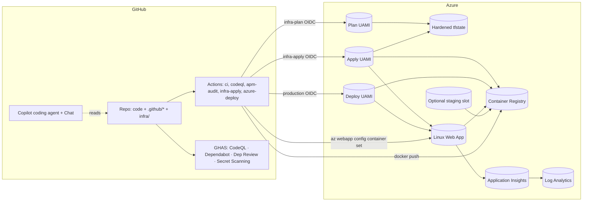

# Architecture

A one-page tour of the components, boundaries, and data flow in the
**GitHub Agentic SDLC Starter Pack**. For the day-to-day developer loop
see [`agentic-sdlc.md`](./agentic-sdlc.md); for the file-ownership rules
see [`apm-ownership-model.md`](./apm-ownership-model.md).

## High-level

## Components

| Component | Where it lives | Owns |
|-----------|----------------|------|
| **Sample app** | [`app/`](../app) | Node.js 22 ESM + Express 5 app, live APIs, control-plane UI, Azure Monitor preload, Dockerfile |
| **App infra** | [`infra/app/`](../infra/app) | ACR, App Service Plan, Linux Web App, optional S1+ staging slot, Log Analytics, Application Insights |
| **Bootstrap infra** | [`infra/bootstrap/`](../infra/bootstrap) | Plan/apply/deploy UAMIs, exact environment credentials, scoped RBAC, app RG, hardened tfstate |
| **Agent context** | [`.github/`](../.github) | Hand-authored Copilot primitives (instructions, prompts, chatmodes, agents, skills, hooks, MCP) |
| **APM layer** | [`apm.yml`](../apm.yml), `apm-policy.yml`, `apm.lock.yaml` | Supplementary deps from `github/awesome-copilot` |
| **CI/CD** | [`.github/workflows/`](../.github/workflows) | 10 workflows: lint+test+sec+infra+deploy + Copilot setup |
| **Branch protection** | [`.github/rulesets/`](../.github/rulesets) | Evaluate-mode default, enforce-mode for graduated repos |

## Trust boundaries

| Boundary | Crosses what | Hardening |
|----------|--------------|-----------|
| Developer ↔ GitHub | Code + workflow files | Branch protection rulesets, required reviews, CODEOWNERS |
| GitHub ↔ Azure | Workflow → cloud API | Separate UAMIs and immutable exact environment subjects (`infra-plan`, `infra-apply`, `production`) |
| Web App/slot ↔ ACR | Image pull | Each slot has its own system-assigned MI and registry-scoped `AcrPull`; ACR admin user disabled |
| App ↔ Application Insights | Telemetry | Connection string injected via Web App app settings (not in source) |
| External ↔ Web App | HTTPS | TLS termination at App Service; no public ports on ACR or LAW |

## Data flow — happy path deploy

1. Developer (or Copilot agent) opens a PR → `ci.yml` + `codeql.yml` +
   `apm-audit.yml` + `dependency-review.yml` run, plus `terraform fmt`
   + `validate` for any `infra/**` change.
2. Reviewer approves → squash merge to `main`.
3. `azure-deploy.yml` triggers on push to `main` with `environment:
   production`. The job exchanges its OIDC token for an Azure access
   token using the production UAMI and exact immutable repository/environment
   subject.
4. `az acr login` → BuildKit build/push (SHA inventory tag + SBOM/provenance)
   → validate the returned `sha256:` digest.
   CI uses Trivy with `ignore-unfixed: true`: fixed HIGH/CRITICAL findings
   block, while vulnerabilities without an upstream fix remain visible for
   risk review instead of accumulating blanket CVE ignores.
5. Default B1 flow: capture the exact `linuxFxVersion`, update production by
   digest, restart, verify config, and probe `/health`. Failure restores the
   exact prior image and verifies rollback health while keeping the job red.
6. Optional S1+ flow: verify both slot identities, scoped `AcrPull`, and
   equivalent secure settings; deploy/warm staging by digest; swap; and probe
   production. Failure after promotion swaps again and verifies the prior
   production image.
7. Telemetry flows from the Web App → Application Insights → Log
   Analytics. Health probe at `GET /health` returns `{"status":"ok"}`.

## What's intentionally **not** here in v1.0

- **AKS / self-hosted runners** — too big a setup story for the
  baseline; documented as a future variant.
- **Bicep / azd** — Terraform was chosen for the depth of the OIDC
  spike. Bicep stays a possible future variant.
- **Artifact signing policy** — BuildKit emits SBOM and SLSA provenance
  attestations, but the baseline intentionally adds no long-lived signing key.
  Regulated adopters can add keyless Sigstore or approved key-backed signing.
- **GHES considerations** — only flagged in
  [`enterprise-hardening.md`](./enterprise-hardening.md); the baseline
  targets dotcom.
