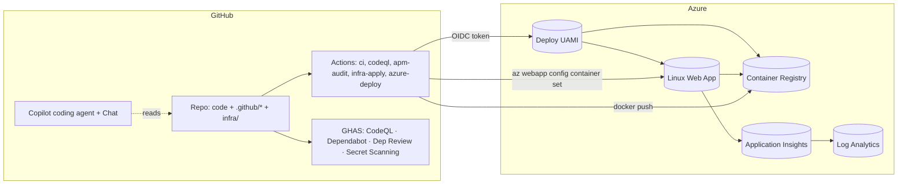

# Architecture

A one-page tour of the components, boundaries, and data flow in the
**GitHub Agentic SDLC Starter Pack**. For the day-to-day developer loop
see [`agentic-sdlc.md`](./agentic-sdlc.md); for the file-ownership rules
see [`apm-ownership-model.md`](./apm-ownership-model.md).

## High-level

## Components

| Component | Where it lives | Owns |
|-----------|----------------|------|
| **Sample app** | [`app/`](../app) | Express HTTP API on Node.js 22 + Dockerfile |
| **App infra** | [`infra/app/`](../infra/app) | ACR, App Service Plan, Linux Web App, Log Analytics, Application Insights |
| **Bootstrap infra** | [`infra/bootstrap/`](../infra/bootstrap) | UAMI, federated credentials, app RG, tfstate backend |
| **Agent context** | [`.github/`](../.github) | Hand-authored Copilot primitives (instructions, prompts, chatmodes, agents, skills, hooks, MCP) |
| **APM layer** | [`apm.yml`](../apm.yml), `apm-policy.yml`, `apm.lock.yaml` | Supplementary deps from `github/awesome-copilot` |
| **CI/CD** | [`.github/workflows/`](../.github/workflows) | 10 workflows: lint+test+sec+infra+deploy + Copilot setup |
| **Branch protection** | [`.github/rulesets/`](../.github/rulesets) | Evaluate-mode default, enforce-mode for graduated repos |

## Trust boundaries

| Boundary | Crosses what | Hardening |
|----------|--------------|-----------|
| Developer ↔ GitHub | Code + workflow files | Branch protection rulesets, required reviews, CODEOWNERS |
| GitHub ↔ Azure | Workflow → cloud API | OIDC federated credentials (no shared secrets); env-scoped subjects (`production`, `infra-apply`) |
| Web App ↔ ACR | Image pull | Web App's system-assigned MI with `AcrPull` role on the registry; ACR admin user disabled |
| App ↔ Application Insights | Telemetry | Connection string injected via Web App app settings (not in source) |
| External ↔ Web App | HTTPS | TLS termination at App Service; no public ports on ACR or LAW |

## Data flow — happy path deploy

1. Developer (or Copilot agent) opens a PR → `ci.yml` + `codeql.yml` +
   `apm-audit.yml` + `dependency-review.yml` run, plus `terraform fmt`
   + `validate` for any `infra/**` change.
2. Reviewer approves → squash merge to `main`.
3. `azure-deploy.yml` triggers on push to `main` with `environment:
   production`. The job exchanges its OIDC token for an Azure access
   token (federated credential subject:
   `repo:<owner>/<repo>:environment:production`).
4. `az acr login` → `docker build` → `docker push` (image tag = SHA).
5. `az webapp config container set` updates the Web App to point at the
   new image; App Service pulls via the Web App MI's `AcrPull` role.
6. Telemetry flows from the Web App → Application Insights → Log
   Analytics. Health probe at `GET /health` returns `{"status":"ok"}`.

## What's intentionally **not** here in v1.0

- **AKS / self-hosted runners** — too big a setup story for the
  baseline; documented as a future variant.
- **Bicep / azd** — Terraform was chosen for the depth of the OIDC
  spike. Bicep stays a possible future variant.
- **SBOM + provenance pinning** — solid v1.1 candidate (Syft, npm
  provenance, image digest pinning). Tracked in
  [`maintenance-matrix.md`](./maintenance-matrix.md).
- **GHES considerations** — only flagged in
  [`enterprise-hardening.md`](./enterprise-hardening.md); the baseline
  targets dotcom.
