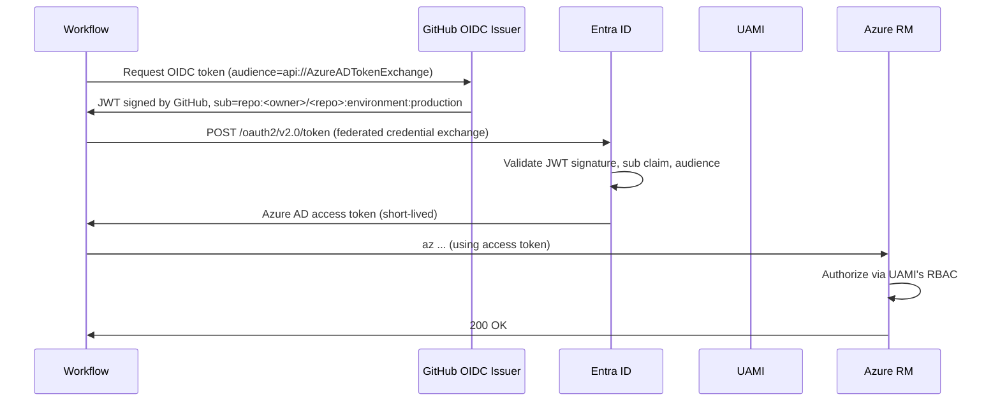

# Azure OIDC setup

How the federated identity flow works, and how to provision / rotate /
debug it. Condensed from
[`spike-d-azure-oidc.md`](./spike-d-azure-oidc.md), which has the
full research notes.

## Why OIDC

Without OIDC, deploying to Azure from GitHub Actions requires storing
either:

- A **service principal client secret** (long-lived, must be rotated),
  or
- A **service principal certificate** (must be uploaded as a GitHub
  secret, must be rotated).

Both are credentials that, if leaked, give the attacker your Azure
foothold. OIDC eliminates them: GitHub Actions presents an OIDC token
to Azure AD, which exchanges it for a short-lived access token after
checking the token's `sub` claim against the federated credential
configured on a User-Assigned Managed Identity.

**No long-lived credential lives in GitHub.**

## What gets created

`./scripts/setup-azure-oidc.sh` runs
`terraform -chdir=infra/bootstrap apply` which creates:

| Resource | Purpose |
|----------|---------|
| **App resource group** | Container for the app's Azure resources |
| **User-Assigned Managed Identity (UAMI)** | The deploy identity workflows assume |
| **Federated credential: `production`** | Subject `repo:<owner>/<repo>:environment:production` — used by `azure-deploy.yml` |
| **Federated credential: `infra-apply`** | Subject `repo:<owner>/<repo>:environment:infra-apply` — used by `infra-apply.yml` |
| **Federated credential: `pull_request`** | Subject `repo:<owner>/<repo>:pull_request` — used by PR-time `terraform plan` (currently disabled by default; see Spike D §4 fork-safety note) |
| **RG-scope role assignments** | `Contributor` + `User Access Administrator` to the UAMI on the app RG only |
| **tfstate Storage Account + container** | Remote state for `infra/app`. UAMI gets `Storage Blob Data Contributor` on the container. |

Then the script reads `terraform output` and runs `gh variable set` to
populate the seven `AZURE_*` repo variables in
[`repo-settings-checklist.md`](./repo-settings-checklist.md#6--repo-variables-set-by-setup-azure-oidcsh).

## Trust chain



## Rotation procedure (skill: `oidc-rotation`)

The federated credential's `sub` claim is **literal**. If you rename
the repo, transfer it to a new owner, or rename the GitHub environment,
the OIDC exchange will fail with `AADSTS70021: No matching federated
identity record found`.

When that happens:

1. `cd infra/bootstrap`
2. `terraform apply` again — Terraform will detect the renamed values
   in `var.github_owner`, `var.github_repo`, or env name and update the
   federated credential subjects in place.
3. No GitHub variable changes needed (the `client_id`/`tenant_id`/
   `subscription_id` don't change).

The hand-authored skill at
[`.github/skills/oidc-rotation/SKILL.md`](../.github/skills/oidc-rotation/SKILL.md)
walks Copilot through the same steps interactively.

## Debugging failures

| Error | Likely cause | Fix |
|-------|--------------|-----|
| `AADSTS70021: No matching federated identity record found` | `sub` claim mismatch | Check repo / owner / environment names match the federated credential |
| `AADSTS70025: Application doesn't have any federated identity credentials` | Federated cred not created | Re-run `setup-azure-oidc.sh` |
| `AuthorizationFailed: ... does not have authorization to perform action 'Microsoft.Resources/...'` | UAMI lacks RBAC at the right scope | Check the role assignments under the app RG; bootstrap creates them at RG scope only |
| `terraform plan` succeeds locally, fails in CI with cred error | Workflow missing `permissions: id-token: write` | Add it to the workflow's `permissions:` block |
| Pull-request `terraform plan` errors when run from a fork | Fork PRs don't get OIDC tokens by design | Run plan inside `infra-apply.yml` after merge (current default) |

## Variables, not secrets

`AZURE_CLIENT_ID`, `AZURE_TENANT_ID`, and `AZURE_SUBSCRIPTION_ID` are
**not credentials** — they're public identifiers. Microsoft's own docs
recommend storing them as variables, not secrets. Doing so means:

- They're visible in workflow logs (helpful when debugging)
- They don't need to be rotated
- Forks of this repo can see the IDs (which doesn't grant any access —
  the federated credential's `sub` claim is the security boundary)

## Manual Azure changes

Two AZURE variables that the script **cannot** set automatically because
they don't exist until `infra/app` runs for the first time:

- `AZURE_ACR_NAME` — the ACR's name
- `AZURE_WEBAPP_NAME` — the Web App's name

After the first successful `infra-apply.yml` run, copy them from the
job summary and set them via:

```bash
gh variable set AZURE_ACR_NAME --body "<acr-name>"
gh variable set AZURE_WEBAPP_NAME --body "<webapp-name>"
```

(The setup script prints these instructions on completion.)
