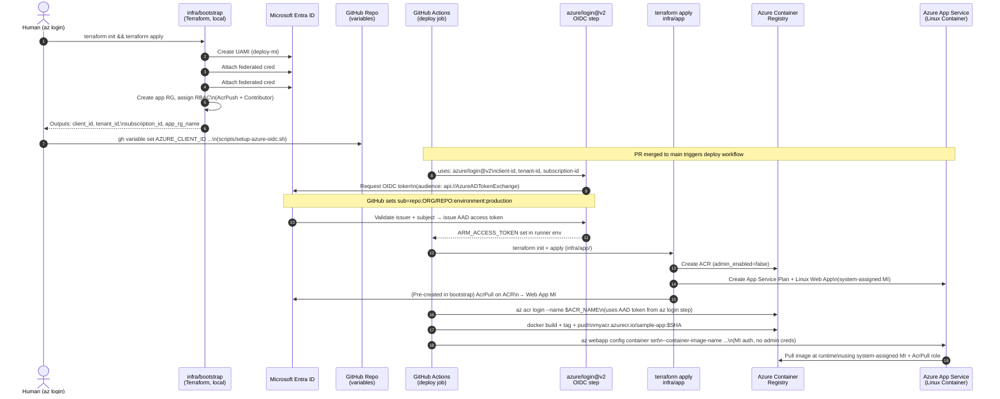

> **Status:** Research complete — ready for Phase 5 implementation  
> **Date:** 2025-07-07  
> **Author:** Spike D research agent  
> **Sources:** Microsoft Learn, Azure/login GitHub Action README, Terraform azurerm provider source docs (hashicorp/terraform-provider-azurerm `main` branch, SHA `40e28f0` / `6f55192`)

---

## Table of Contents

1. [End-to-End Architecture](#1-end-to-end-architecture)
2. [Federated Credential Subject Claims (Verified)](#2-federated-credential-subject-claims-verified)
3. [RBAC Matrix](#3-rbac-matrix)
4. [Bootstrap Terraform — Suggested Resources](#4-bootstrap-terraform--suggested-resources)
5. [App Terraform — Suggested Resources](#5-app-terraform--suggested-resources)
6. [Deploy Workflow Sketch](#6-deploy-workflow-sketch)
7. [Failure Modes Catalog](#7-failure-modes-catalog)
8. [Bootstrap Setup Script Sketch](#8-bootstrap-setup-script-sketch)
9. [Cost Ballpark](#9-cost-ballpark)
10. [Open Questions](#10-open-questions)

---

## 1. End-to-End Architecture

### Mermaid Diagram



### ASCII Summary

```
┌─────────────────────────────────────────────────────────────────┐
│  BOOTSTRAP (one-time, human, az login)                          │
│  infra/bootstrap/                                               │
│  ┌─────────────────────────────────────────────────────────┐   │
│  │ UAMI (deploy-mi)                                        │   │
│  │   ├── Federated cred: repo:ORG/REPO:environment:prod   │   │
│  │   └── Federated cred: repo:ORG/REPO:pull_request       │   │
│  │ Resource Group (app-rg)                                 │   │
│  │ RBAC: deploy-mi → AcrPush (ACR scope)                  │   │
│  │ RBAC: deploy-mi → Contributor (app-rg scope)           │   │
│  │ RBAC: webapp-system-mi → AcrPull (ACR scope)  ← NOTE:  │   │
│  │        Pre-create here IF Terraform creates the webapp  │   │
│  └─────────────────────────────────────────────────────────┘   │
│  ↓ terraform output → scripts/setup-azure-oidc.sh              │
│  ↓ gh variable set AZURE_CLIENT_ID / TENANT_ID / SUB_ID        │
└─────────────────────────────────────────────────────────────────┘

┌─────────────────────────────────────────────────────────────────┐
│  CI DEPLOY (push to main, environment: production)              │
│                                                                 │
│  1. azure/login@v2 (OIDC)                                       │
│     ├── GitHub mints JWT: sub=repo:ORG/REPO:environment:prod    │
│     │   aud=api://AzureADTokenExchange                          │
│     └── Entra validates → returns AAD access token             │
│                                                                 │
│  2. terraform apply infra/app/                                  │
│     └── Creates: ACR, App Service Plan, Linux Web App, LAW, AI  │
│                                                                 │
│  3. az acr login --name $ACR_NAME                               │
│     └── Uses AAD token from step 1 (no ACR admin creds)        │
│                                                                 │
│  4. docker build + push → ACR                                   │
│                                                                 │
│  5. az webapp config container set --name ... --image ...       │
│     └── App Service pulls image via system-assigned MI + AcrPull│
└─────────────────────────────────────────────────────────────────┘
```

---

## 2. Federated Credential Subject Claims (Verified)

### Core Parameters

| Parameter | Verified Value | Source |
|-----------|---------------|--------|
| **Issuer** | `https://token.actions.githubusercontent.com` | Microsoft Learn — Federated Identity Credentials |
| **Audience** | `api://AzureADTokenExchange` | `azure/login` README: "default audience is `api://AzureADTokenExchange`" |
| **Subject** | See formats below | Microsoft Learn, Terraform azurerm OIDC guide |

> **Source:** [Microsoft Learn — Manage federated identity credentials](https://learn.microsoft.com/en-us/azure/active-directory/workload-identities/workload-identity-federation-create-trust) (verified 2025-07-07)  
> **Source:** [Azure/login GitHub README](https://github.com/Azure/login) (verified 2025-07-07)

### Subject Claim Formats

#### ✅ RECOMMENDED — Environment-bound (deploy job)

```
repo:OWNER/REPO:environment:production
```

**Example:** `repo:my-org/my-app:environment:production`

Use this for the main deploy job. The job **must** declare `environment: production` in the workflow YAML, which triggers GitHub's environment protection rules (required reviewers, deployment branch policy). This provides the strongest policy boundary.

```yaml
jobs:
  deploy:
    runs-on: ubuntu-latest
    environment: production   # ← this binds to the subject claim
    permissions:
      id-token: write
      contents: read
    steps:
      - uses: azure/login@v2
        with:
          client-id: ${{ vars.AZURE_CLIENT_ID }}
          tenant-id: ${{ vars.AZURE_TENANT_ID }}
          subscription-id: ${{ vars.AZURE_SUBSCRIPTION_ID }}
```

#### ⚠️  OPTIONAL — Pull request (plan-on-PR)

```
repo:OWNER/REPO:pull_request
```

**Example:** `repo:my-org/my-app:pull_request`

Use this for a read-only `terraform plan` job on PRs. The RBAC scope for this credential should be narrowed to `Reader` only — it does not need `AcrPush` or `Contributor`. Gate by `var.enable_pr_plan` in bootstrap so it can be disabled for repos where PR runs are out of scope for Phase 1.

#### ❌ NOT RECOMMENDED — Branch ref

```
repo:OWNER/REPO:ref:refs/heads/main
```

Do **not** use this for the deploy credential. It is weaker than the environment variant because:
- It does not enforce GitHub environment protection rules (no required reviewers).
- Any workflow running on `main` (including non-deploy workflows) could trigger the OIDC exchange.
- There is no explicit deployment gate.

#### ℹ️  FOR REFERENCE — Reusable workflow guard

```
repo:OWNER/REPO:job_workflow_ref:OWNER/REPO/.github/workflows/deploy.yml@refs/heads/main
```

Pin the federated credential to a specific reusable workflow file and ref. Useful in multi-repo enterprise setups where a central deploy workflow is shared. Out of scope for Phase 1.

### Critical: Subject Matching is EXACT — No Wildcards

> **"Wildcard characters aren't supported in any federated identity credential property value."**  
> — [Microsoft Learn, Federated Identity Credential considerations](https://learn.microsoft.com/en-us/azure/active-directory/workload-identities/workload-identity-federation-create-trust)

> **"The subject setting values must exactly match the configuration on the GitHub workflow configuration. Otherwise, Microsoft identity platform will look at the incoming external token and reject the exchange for an access token. You won't get an error, the exchange fails without error."**  
> — Microsoft Learn (emphasis added)

**Pattern matching (wildcards in subject) is NOT generally available as of this report date.** Microsoft has indicated awareness of the limitation but the feature remains preview/unavailable for GitHub Actions subjects. Do not plan on wildcard subjects.

### Subject Pattern Matching — Status

Microsoft announced subject claim pattern matching for federated credentials in preview for some workload types. **As of 2025-07-07, this is NOT available for GitHub Actions subjects via the standard `azurerm_federated_identity_credential` Terraform resource.** The `subject` field in `azurerm_federated_identity_credential` accepts a plain string only (no glob patterns). Phase 5 must create one resource per subject claim.

### Federated Credentials Required (2 per UAMI)

Bootstrap creates **one UAMI** but attaches **two federated credentials** to it:

```hcl
# Credential 1 — deploy job (environment-bound)
resource "azurerm_federated_identity_credential" "deploy_prod" {
  name                      = "github-actions-deploy-production"
  resource_group_name       = azurerm_resource_group.bootstrap.name
  parent_id                 = azurerm_user_assigned_identity.deploy.id
  issuer                    = "https://token.actions.githubusercontent.com"
  subject                   = "repo:${var.github_owner}/${var.github_repo}:environment:production"
  audience                  = ["api://AzureADTokenExchange"]
}

# Credential 2 — PR plan job (optional, gated by variable)
resource "azurerm_federated_identity_credential" "pr_plan" {
  count                     = var.enable_pr_plan ? 1 : 0
  name                      = "github-actions-pr-plan"
  resource_group_name       = azurerm_resource_group.bootstrap.name
  parent_id                 = azurerm_user_assigned_identity.deploy.id
  issuer                    = "https://token.actions.githubusercontent.com"
  subject                   = "repo:${var.github_owner}/${var.github_repo}:pull_request"
  audience                  = ["api://AzureADTokenExchange"]
}
```

> **Source:** `hashicorp/terraform-provider-azurerm:website/docs/r/federated_identity_credential.html.markdown` (API provider: `Microsoft.ManagedIdentity` 2024-11-30)  
> Maximum of **20** federated credentials per UAMI (Microsoft Learn limit).

---

## 3. RBAC Matrix

### Full Matrix

| Identity | Role | Scope | Why | Where Created |
|----------|------|-------|-----|---------------|
| Deploy UAMI (`deploy-mi`) | `AcrPush` | ACR resource | Push container images during deploy workflow | **Bootstrap** |
| Deploy UAMI (`deploy-mi`) | `Contributor` | App Resource Group | Manage App Service Plan, Linux Web App, Log Analytics, App Insights | **Bootstrap** |
| Deploy UAMI (`deploy-mi`) | `User Access Administrator` | App RG | **Only needed if `infra/app` Terraform creates role assignments.** See recommendation below. | **Bootstrap (if needed)** |
| Web App system-assigned MI | `AcrPull` | ACR resource | Pull container image at runtime — no admin creds needed | **Bootstrap** (pre-create) or App TF |
| Bootstrap operator (human) | `Owner` or (`Contributor` + `User Access Administrator`) | Subscription or RG | One-time bootstrap run with `az login`. Minimum: ability to create RGs, identities, and role assignments. | Azure portal / manual |

### ⭐ Recommendation: Pre-Create ALL RBAC in Bootstrap

**Do NOT give the Deploy UAMI `User Access Administrator` on the App RG.**

Instead, pre-create the Web App system-assigned MI's `AcrPull` role assignment during bootstrap. This requires knowing the Web App's system MI principal ID **before** the web app exists — which is the bootstrap chicken-and-egg challenge.

**Two approaches to resolve:**

**Option A (recommended):** Use a **user-assigned MI** on the Web App for ACR pull (not the system-assigned MI). Bootstrap creates this MI and grants it `AcrPull` on the ACR. The App Terraform attaches this UAMI to the web app and sets `container_registry_managed_identity_client_id`. This eliminates the chicken-and-egg entirely.

**Option B:** Accept that the first `infra/app` apply creates the Web App (which auto-creates a system MI), then a separate bootstrap or post-deploy step assigns `AcrPull` to that principal ID. The deploy UAMI needs `User Access Administrator` for this scenario — not ideal.

**Option C (pragmatic for Phase 1):** Create the `AcrPull` assignment in `infra/app` Terraform by granting the deploy UAMI `User Access Administrator` scoped only to the ACR resource (not the whole RG). This is a narrower scope than RG-level UAA.

**Phase 5 recommendation: Option A** — user-assigned MI for ACR pull, all RBAC in bootstrap. Deploy UAMI never needs UAA.

### RBAC Least-Privilege Analysis

```
Deploy UAMI minimum permissions:
  ├── AcrPush on /subscriptions/.../resourceGroups/app-rg/providers/Microsoft.ContainerRegistry/registries/myacr
  └── Contributor on /subscriptions/.../resourceGroups/app-rg
      (Contributor covers: App Service, Service Plan, Log Analytics, App Insights)

Note: If ACR is in a different RG from the app resources (common pattern):
  ├── AcrPush on ACR resource
  └── Contributor on app-rg (does NOT include the ACR RG)
```

> **Source:** [Microsoft Learn — Container Registry Authentication with Managed Identity](https://learn.microsoft.com/en-us/azure/container-registry/container-registry-authentication-managed-identity) (verified 2025-07-07)

---

## 4. Bootstrap Terraform — Suggested Resources

**Location:** `infra/bootstrap/`  
**Run:** One-time by a human with `az login`. State stored locally or in a separate pre-existing storage account.

### Resource Inventory

```hcl
# infra/bootstrap/main.tf — resource sketch for Phase 5

terraform {
  required_providers {
    azurerm = {
      source  = "hashicorp/azurerm"
      version = "~> 4.0"
    }
  }
  # For bootstrap, state is local (or managed manually).
  # Do NOT point at the same storage account being created below
  # (obvious chicken-and-egg). Options:
  # 1. Local state committed to .gitignore (acceptable for one-time bootstrap)
  # 2. Pre-existing storage account (org-owned tfstate account)
}

provider "azurerm" {
  features {}
  # Auth: uses az login credentials from the human operator.
  # No use_oidc = true here — this is the bootstrap, not CI.
  subscription_id = var.subscription_id
}

# ── Resource Groups ──────────────────────────────────────────────────────────

resource "azurerm_resource_group" "app" {
  name     = var.app_rg_name       # e.g. "agentic-sdlc-app-rg"
  location = var.location
  tags     = local.common_tags
}

# Optional: separate RG for tfstate storage account
resource "azurerm_resource_group" "state" {
  count    = var.create_state_rg ? 1 : 0
  name     = var.state_rg_name     # e.g. "agentic-sdlc-state-rg"
  location = var.location
  tags     = local.common_tags
}

# ── Terraform State Backend ───────────────────────────────────────────────────

resource "azurerm_storage_account" "tfstate" {
  count                    = var.create_state_backend ? 1 : 0
  name                     = var.state_storage_account_name  # globally unique
  resource_group_name      = local.state_rg_name
  location                 = var.location
  account_tier             = "Standard"
  account_replication_type = "LRS"
  min_tls_version          = "TLS1_2"
  tags                     = local.common_tags
}

resource "azurerm_storage_container" "tfstate" {
  count                 = var.create_state_backend ? 1 : 0
  name                  = "tfstate"
  storage_account_id    = azurerm_storage_account.tfstate[0].id
  container_access_type = "private"
}

# ── Deploy Managed Identity ───────────────────────────────────────────────────

resource "azurerm_user_assigned_identity" "deploy" {
  name                = var.deploy_identity_name    # e.g. "agentic-sdlc-deploy-mi"
  resource_group_name = azurerm_resource_group.app.name
  location            = azurerm_resource_group.app.location
  tags                = local.common_tags
}

# ── Federated Identity Credentials ───────────────────────────────────────────
# One per subject claim. No wildcards. Exact match required.

resource "azurerm_federated_identity_credential" "deploy_production" {
  name                = "github-deploy-production"
  resource_group_name = azurerm_resource_group.app.name
  parent_id           = azurerm_user_assigned_identity.deploy.id
  issuer              = "https://token.actions.githubusercontent.com"
  subject             = "repo:${var.github_owner}/${var.github_repo}:environment:production"
  audience            = ["api://AzureADTokenExchange"]
}

resource "azurerm_federated_identity_credential" "pr_plan" {
  count               = var.enable_pr_plan ? 1 : 0
  name                = "github-pr-plan"
  resource_group_name = azurerm_resource_group.app.name
  parent_id           = azurerm_user_assigned_identity.deploy.id
  issuer              = "https://token.actions.githubusercontent.com"
  subject             = "repo:${var.github_owner}/${var.github_repo}:pull_request"
  audience            = ["api://AzureADTokenExchange"]
}

# ── ACR (pre-created in bootstrap so RBAC can be assigned) ────────────────────
# Note: If ACR lifecycle belongs in infra/app, move it there and
# accept Option B/C for RBAC (see Section 3). For cleanest bootstrap,
# create ACR here.

resource "azurerm_container_registry" "main" {
  name                = var.acr_name     # globally unique, alphanumeric only
  resource_group_name = azurerm_resource_group.app.name
  location            = azurerm_resource_group.app.location
  sku                 = "Basic"          # upgrade to "Standard" for geo-redundancy
  admin_enabled       = false            # NEVER enable — use MI auth
  tags                = local.common_tags
}

# ── RBAC Assignments ──────────────────────────────────────────────────────────

# Deploy MI → AcrPush on ACR (for docker push in CI)
resource "azurerm_role_assignment" "deploy_acr_push" {
  principal_id         = azurerm_user_assigned_identity.deploy.principal_id
  role_definition_name = "AcrPush"
  scope                = azurerm_container_registry.main.id
}

# Deploy MI → Contributor on App RG (for terraform apply infra/app)
resource "azurerm_role_assignment" "deploy_rg_contributor" {
  principal_id         = azurerm_user_assigned_identity.deploy.principal_id
  role_definition_name = "Contributor"
  scope                = azurerm_resource_group.app.id
}

# ACR Pull MI (for web app runtime image pull) — Option A approach
resource "azurerm_user_assigned_identity" "acr_pull" {
  name                = var.acr_pull_identity_name  # e.g. "agentic-sdlc-acrpull-mi"
  resource_group_name = azurerm_resource_group.app.name
  location            = azurerm_resource_group.app.location
  tags                = local.common_tags
}

resource "azurerm_role_assignment" "acr_pull_mi" {
  principal_id         = azurerm_user_assigned_identity.acr_pull.principal_id
  role_definition_name = "AcrPull"
  scope                = azurerm_container_registry.main.id
}

# Optional: Deploy MI → Storage Blob Data Contributor for tfstate backend
resource "azurerm_role_assignment" "deploy_tfstate" {
  count                = var.create_state_backend ? 1 : 0
  principal_id         = azurerm_user_assigned_identity.deploy.principal_id
  role_definition_name = "Storage Blob Data Contributor"
  scope                = azurerm_storage_account.tfstate[0].id
}

# ── Outputs ───────────────────────────────────────────────────────────────────

output "client_id" {
  value       = azurerm_user_assigned_identity.deploy.client_id
  description = "Client ID of the deploy managed identity. Set as AZURE_CLIENT_ID."
}

output "tenant_id" {
  value       = azurerm_user_assigned_identity.deploy.tenant_id
  description = "Tenant ID. Set as AZURE_TENANT_ID."
}

output "subscription_id" {
  value       = var.subscription_id
  description = "Subscription ID. Set as AZURE_SUBSCRIPTION_ID."
}

output "deploy_mi_principal_id" {
  value       = azurerm_user_assigned_identity.deploy.principal_id
  description = "Object ID (principal ID) of the deploy MI."
}

output "acr_pull_mi_client_id" {
  value       = azurerm_user_assigned_identity.acr_pull.client_id
  description = "Client ID of the ACR pull MI for web app container config."
}

output "app_rg_name" {
  value       = azurerm_resource_group.app.name
  description = "App resource group name. Set as AZURE_RESOURCE_GROUP."
}

output "acr_login_server" {
  value       = azurerm_container_registry.main.login_server
  description = "ACR login server URL (e.g. myacr.azurecr.io)."
}

output "acr_name" {
  value       = azurerm_container_registry.main.name
  description = "ACR name (short). Used in az acr login --name."
}
```

### Required Input Variables (sketch)

```hcl
# infra/bootstrap/variables.tf sketch

variable "subscription_id"          { type = string }
variable "location"                  { type = string; default = "eastus" }
variable "github_owner"              { type = string; description = "GitHub org or user" }
variable "github_repo"               { type = string; description = "Repository name only" }
variable "app_rg_name"               { type = string; default = "agentic-sdlc-app-rg" }
variable "deploy_identity_name"      { type = string; default = "agentic-sdlc-deploy-mi" }
variable "acr_pull_identity_name"    { type = string; default = "agentic-sdlc-acrpull-mi" }
variable "acr_name"                  { type = string; description = "Globally unique, alphanumeric" }
variable "enable_pr_plan"            { type = bool;   default = false }
variable "create_state_rg"           { type = bool;   default = true }
variable "create_state_backend"      { type = bool;   default = true }
variable "state_rg_name"             { type = string; default = "agentic-sdlc-state-rg" }
variable "state_storage_account_name"{ type = string }
```

---

## 5. App Terraform — Suggested Resources

**Location:** `infra/app/`  
**Run:** By CI under OIDC on every merge to `main` via the deploy workflow.

### Provider Configuration

```hcl
# infra/app/providers.tf

terraform {
  required_providers {
    azurerm = {
      source  = "hashicorp/azurerm"
      version = "~> 4.0"
    }
  }

  backend "azurerm" {
    resource_group_name  = "agentic-sdlc-state-rg"
    storage_account_name = "REPLACE_DURING_INIT"   # passed via -backend-config
    container_name       = "tfstate"
    key                  = "app/terraform.tfstate"
    use_oidc             = true                    # uses ACTIONS_ID_TOKEN_* env vars
  }
}

provider "azurerm" {
  features {}

  # All three sourced from GitHub Actions variables (not secrets — these are IDs, not credentials)
  # Environment variables: ARM_CLIENT_ID, ARM_TENANT_ID, ARM_SUBSCRIPTION_ID
  # The provider auto-detects ACTIONS_ID_TOKEN_REQUEST_URL and ACTIONS_ID_TOKEN_REQUEST_TOKEN
  # from the GitHub Actions runner when use_oidc = true.
  use_oidc = true
  # client_id, tenant_id, subscription_id are read from ARM_* env vars set by the workflow
}
```

> **Important:** OIDC support was added in **azurerm provider v3.7.0**. Recommend pinning `~> 4.0` for all current features.  
> **Source:** `hashicorp/terraform-provider-azurerm:website/docs/guides/service_principal_oidc.html.markdown`, line 186: "Support for OpenID Connect was added in version 3.7.0 of the Terraform AzureRM provider."

> **Note on env vars:** When `use_oidc = true`, the provider automatically reads `ACTIONS_ID_TOKEN_REQUEST_URL` and `ACTIONS_ID_TOKEN_REQUEST_TOKEN` set by GitHub Actions — no additional configuration needed. Set `ARM_CLIENT_ID`, `ARM_TENANT_ID`, `ARM_SUBSCRIPTION_ID` from the GitHub Actions vars set by `setup-azure-oidc.sh`.

### Resource Inventory

```hcl
# infra/app/main.tf — resource sketch for Phase 5

# ── Variables (passed from workflow env / tfvars) ─────────────────────────────

variable "resource_group_name"    { type = string }   # from AZURE_RESOURCE_GROUP var
variable "acr_name"               { type = string }   # from AZURE_ACR_NAME var
variable "acr_pull_mi_client_id"  { type = string }   # from AZURE_ACR_PULL_MI_CLIENT_ID var
variable "app_name"               { type = string; default = "agentic-sdlc-app" }
variable "location"               { type = string; default = "eastus" }
variable "container_image"        { type = string }   # e.g. "myacr.azurecr.io/sample-app:abc1234"
variable "log_retention_days"     { type = number; default = 30 }
variable "tags"                   { type = map(string); default = {} }

# ── Data Sources ──────────────────────────────────────────────────────────────

data "azurerm_resource_group" "app" {
  name = var.resource_group_name
}

data "azurerm_container_registry" "main" {
  name                = var.acr_name
  resource_group_name = var.resource_group_name
}

# ── Log Analytics Workspace ───────────────────────────────────────────────────

resource "azurerm_log_analytics_workspace" "main" {
  name                = "${var.app_name}-law"
  resource_group_name = data.azurerm_resource_group.app.name
  location            = data.azurerm_resource_group.app.location
  sku                 = "PerGB2018"
  retention_in_days   = var.log_retention_days
  tags                = var.tags
}

# ── Application Insights (workspace-based) ────────────────────────────────────

resource "azurerm_application_insights" "main" {
  name                = "${var.app_name}-ai"
  resource_group_name = data.azurerm_resource_group.app.name
  location            = data.azurerm_resource_group.app.location
  workspace_id        = azurerm_log_analytics_workspace.main.id
  application_type    = "web"
  tags                = var.tags
}

# ── App Service Plan (Linux, B1) ──────────────────────────────────────────────

resource "azurerm_service_plan" "main" {
  name                = "${var.app_name}-plan"
  resource_group_name = data.azurerm_resource_group.app.name
  location            = data.azurerm_resource_group.app.location
  os_type             = "Linux"
  sku_name            = "B1"            # Cheapest paid plan; free tier (F1) doesn't
                                         # support custom containers reliably
  tags                = var.tags
}

# ── Linux Web App for Containers ──────────────────────────────────────────────

resource "azurerm_linux_web_app" "main" {
  name                = var.app_name
  resource_group_name = data.azurerm_resource_group.app.name
  location            = data.azurerm_resource_group.app.location
  service_plan_id     = azurerm_service_plan.main.id
  https_only          = true
  tags                = var.tags

  # Attach the ACR-pull user-assigned MI (created in bootstrap)
  identity {
    type         = "UserAssigned"
    identity_ids = ["/subscriptions/${data.azurerm_resource_group.app.id}/..."]
    # Phase 5: reference the UAMI resource ID via a data source or variable
  }

  site_config {
    # ── Container configuration ──────────────────────────────────────────────
    application_stack {
      docker_image_name   = var.container_image          # e.g. "myacr.azurecr.io/sample-app:abc1234"
                                                          # Note: full registry URL is part of docker_image_name
      docker_registry_url = "https://${data.azurerm_container_registry.main.login_server}"
      # docker_registry_username and docker_registry_password are intentionally
      # OMITTED — using managed identity auth instead
    }

    # ── Managed Identity for ACR Pull ────────────────────────────────────────
    # Tells App Service to authenticate to ACR using MI (not admin creds)
    container_registry_use_managed_identity       = true
    container_registry_managed_identity_client_id = var.acr_pull_mi_client_id
    # ^ set to the client_id of the acr_pull user-assigned MI from bootstrap output
  }

  app_settings = {
    APPLICATIONINSIGHTS_CONNECTION_STRING = azurerm_application_insights.main.connection_string
    ApplicationInsightsAgent_EXTENSION_VERSION = "~3"
    WEBSITES_PORT = "3000"   # must match the port your container listens on
  }
}

# ── Outputs ───────────────────────────────────────────────────────────────────

output "web_app_url" {
  value       = "https://${azurerm_linux_web_app.main.default_hostname}"
  description = "Public URL of the deployed app."
}

output "web_app_name" {
  value       = azurerm_linux_web_app.main.name
  description = "App Service name (for az webapp commands)."
}

output "acr_login_server" {
  value       = data.azurerm_container_registry.main.login_server
  description = "ACR login server (e.g. myacr.azurecr.io)."
}

output "app_insights_connection_string" {
  value     = azurerm_application_insights.main.connection_string
  sensitive = true
}
```

### Key Property Verification

| Terraform Property | Location | Verified Value/Behavior | Source |
|-------------------|----------|------------------------|--------|
| `container_registry_use_managed_identity` | `azurerm_linux_web_app.site_config` | `true` — "Should connections for Azure Container Registry use Managed Identity" | `hashicorp/terraform-provider-azurerm:website/docs/r/linux_web_app.html.markdown` line 709 |
| `container_registry_managed_identity_client_id` | `azurerm_linux_web_app.site_config` | Client ID of the UAMI to use for ACR pull | Same source, line 707 |
| `docker_image_name` | `site_config.application_stack` | The docker image including tag; for private ACR use full path `myacr.azurecr.io/app:tag` | Same source, line 173 |
| `docker_registry_url` | `site_config.application_stack` | Registry URL; e.g. `https://myacr.azurecr.io` | Same source, line 175 |
| `admin_enabled = false` | `azurerm_container_registry` | Disables ACR admin creds — MI auth is then the only path | Terraform + MS docs |

> **Equivalent `az webapp` CLI property:** `acrUseManagedIdentityCreds: true` (set via `az webapp config set --generic-configurations`)  
> **Source:** [Microsoft Learn — Configure custom container](https://learn.microsoft.com/en-us/azure/app-service/configure-custom-container) (verified 2025-07-07)

---

## 6. Deploy Workflow Sketch

**File:** `.github/workflows/azure-deploy.yml`

```yaml
name: Deploy to Azure

on:
  push:
    branches: [main]

# Permissions required for OIDC token exchange
permissions:
  id-token: write   # REQUIRED — allows GitHub to mint an OIDC token
  contents: read    # REQUIRED — allows checkout

jobs:
  deploy:
    name: Deploy to Azure App Service
    runs-on: ubuntu-latest
    environment: production        # MUST match the federated credential subject claim:
                                   # repo:OWNER/REPO:environment:production

    env:
      # These are GitHub Actions Variables (not secrets — they are IDs, not credentials)
      # Set by scripts/setup-azure-oidc.sh via gh variable set
      ARM_CLIENT_ID:       ${{ vars.AZURE_CLIENT_ID }}
      ARM_TENANT_ID:       ${{ vars.AZURE_TENANT_ID }}
      ARM_SUBSCRIPTION_ID: ${{ vars.AZURE_SUBSCRIPTION_ID }}

    steps:
      # ── Step 1: Checkout ────────────────────────────────────────────────────
      - name: Checkout
        uses: actions/checkout@v4

      # ── Step 2: Azure OIDC Login ─────────────────────────────────────────────
      # Exchanges the GitHub OIDC JWT for an Azure AAD access token.
      # No client secret used. Audience = api://AzureADTokenExchange (default).
      - name: Azure Login (OIDC)
        uses: azure/login@v2
        with:
          client-id:       ${{ vars.AZURE_CLIENT_ID }}
          tenant-id:       ${{ vars.AZURE_TENANT_ID }}
          subscription-id: ${{ vars.AZURE_SUBSCRIPTION_ID }}
          # enable-AzPSSession: false  (default; omit unless you need PowerShell)

      # ── Step 3: Terraform — infra/app ────────────────────────────────────────
      # The azurerm provider reads ARM_CLIENT_ID, ARM_TENANT_ID, ARM_SUBSCRIPTION_ID
      # from env, and reads ACTIONS_ID_TOKEN_REQUEST_URL + ACTIONS_ID_TOKEN_REQUEST_TOKEN
      # automatically (set by GitHub Actions runtime).
      - name: Setup Terraform
        uses: hashicorp/setup-terraform@v3
        with:
          terraform_version: "~1.9"

      - name: Terraform Init
        working-directory: infra/app
        run: |
          terraform init \
            -backend-config="storage_account_name=${{ vars.AZURE_TFSTATE_STORAGE_ACCOUNT }}" \
            -backend-config="resource_group_name=${{ vars.AZURE_STATE_RG_NAME }}"

      - name: Terraform Apply
        working-directory: infra/app
        run: |
          terraform apply -auto-approve \
            -var="resource_group_name=${{ vars.AZURE_RESOURCE_GROUP }}" \
            -var="acr_name=${{ vars.AZURE_ACR_NAME }}" \
            -var="acr_pull_mi_client_id=${{ vars.AZURE_ACR_PULL_MI_CLIENT_ID }}" \
            -var="container_image=${{ vars.AZURE_ACR_NAME }}.azurecr.io/sample-app:${{ github.sha }}"

      # ── Step 4: Build & Push Container Image ─────────────────────────────────
      # az acr login uses the AAD token from the azure/login step above.
      # No ACR admin credentials needed (admin_enabled = false).
      - name: Login to ACR
        run: az acr login --name ${{ vars.AZURE_ACR_NAME }}

      - name: Build Docker image
        run: |
          docker build \
            -t ${{ vars.AZURE_ACR_NAME }}.azurecr.io/sample-app:${{ github.sha }} \
            -t ${{ vars.AZURE_ACR_NAME }}.azurecr.io/sample-app:latest \
            app/

      - name: Push Docker image
        run: |
          docker push ${{ vars.AZURE_ACR_NAME }}.azurecr.io/sample-app:${{ github.sha }}
          docker push ${{ vars.AZURE_ACR_NAME }}.azurecr.io/sample-app:latest

      # ── Step 5: Update Web App Container Image ────────────────────────────────
      # Points App Service at the new image. The app uses its user-assigned MI
      # (with AcrPull) to pull the image — no registry credentials passed here.
      - name: Update Web App container image
        run: |
          az webapp config container set \
            --name ${{ vars.AZURE_APP_NAME }} \
            --resource-group ${{ vars.AZURE_RESOURCE_GROUP }} \
            --container-image-name "${{ vars.AZURE_ACR_NAME }}.azurecr.io/sample-app:${{ github.sha }}" \
            --container-registry-url "https://${{ vars.AZURE_ACR_NAME }}.azurecr.io"
          # Note: do NOT pass --docker-registry-server-user / --password
          # The acrUseManagedIdentityCreds flag (set via Terraform) handles auth.

      # ── Step 6: Restart Web App (optional) ───────────────────────────────────
      - name: Restart Web App
        run: |
          az webapp restart \
            --name ${{ vars.AZURE_APP_NAME }} \
            --resource-group ${{ vars.AZURE_RESOURCE_GROUP }}

      # ── Step 7: Health Check (optional) ──────────────────────────────────────
      - name: Smoke test
        run: |
          URL=$(az webapp show \
            --name ${{ vars.AZURE_APP_NAME }} \
            --resource-group ${{ vars.AZURE_RESOURCE_GROUP }} \
            --query defaultHostName -o tsv)
          echo "Checking https://${URL}/health"
          curl --retry 5 --retry-delay 10 --fail "https://${URL}/health"
```

### Required GitHub Actions Variables (set by setup-azure-oidc.sh)

| Variable | Description | Sensitive? |
|----------|-------------|-----------|
| `AZURE_CLIENT_ID` | Deploy UAMI client ID | No (it's a GUID, not a secret) |
| `AZURE_TENANT_ID` | Entra tenant ID | No |
| `AZURE_SUBSCRIPTION_ID` | Azure subscription ID | No |
| `AZURE_RESOURCE_GROUP` | App resource group name | No |
| `AZURE_ACR_NAME` | ACR name (short, without `.azurecr.io`) | No |
| `AZURE_APP_NAME` | App Service name | No |
| `AZURE_ACR_PULL_MI_CLIENT_ID` | Client ID of the ACR-pull UAMI | No |
| `AZURE_TFSTATE_STORAGE_ACCOUNT` | Terraform state storage account name | No |
| `AZURE_STATE_RG_NAME` | Resource group for tfstate | No |

> **Note on Variables vs. Secrets:** Microsoft Learn docs note "For security reasons, we recommend using GitHub Secrets rather than passing values directly." However, these three IDs (client ID, tenant ID, subscription ID) are **not credentials** — they are identifiers. GitHub recommends using **repository variables** (not secrets) for non-sensitive configuration. The federated credential is the actual security boundary. Using `vars.*` (not `secrets.*`) is correct for these IDs.  
> Source: [Microsoft Learn — Connect from Azure OIDC](https://learn.microsoft.com/en-us/azure/developer/github/connect-from-azure-openid-connect)

---

## 7. Failure Modes Catalog

| Symptom | Likely Cause | Resolution |
|---------|-------------|------------|
| `AADSTS70021: No matching federated identity record found` | Subject claim mismatch — the `sub` in the GitHub OIDC token does not match any federated credential | Verify the exact subject format. If job declares `environment: production`, subject is `repo:ORG/REPO:environment:production`. Re-check casing and spelling — exact match, no wildcards. Note: failure is silent — "you won't get an error, the exchange fails without error" (Microsoft docs). |
| `Error: failed to get OIDC token` or `HttpError: 403` | Missing `id-token: write` permission on the job or workflow | Add `permissions: id-token: write` at the job level (or workflow level). Must be explicit — default permissions do NOT include id-token write. |
| `azure/login` step hangs or returns no token | `id-token: write` permission missing; OR workflow triggered by `pull_request` from a fork | Fork PRs cannot access `id-token: write` — this is a GitHub security restriction. For plan-on-PR from forks, use a separate `pull_request_target` trigger with caution. |
| `Terraform: AuthorizationFailed` | Deploy UAMI lacks `Contributor` on the App RG; OR `ARM_CLIENT_ID` / `ARM_TENANT_ID` / `ARM_SUBSCRIPTION_ID` env vars not set | Verify RBAC assignments. Verify GitHub Actions variables are set and referenced with `vars.*` not `secrets.*`. |
| `Terraform: provider requires authentication` or provider falls back to CLI | `use_oidc = true` missing from provider block; OR azurerm provider version < 3.7.0 | Add `use_oidc = true`; upgrade provider to `~> 4.0`. |
| `az acr login: not authorized` | Deploy UAMI lacks `AcrPush` on the ACR; OR `az login` step ran before ACR was created | Verify RBAC. Ensure `az acr login` runs after `azure/login@v2`. Check ACR name is correct (short name, not login server URL). |
| `docker push: denied: requested access to the resource is denied` | ACR admin disabled AND `az acr login` was skipped or failed | Run `az acr login --name $ACR_NAME` before docker push. Do not re-enable admin. |
| App Service pulls old image / doesn't update | `az webapp config container set` not called after docker push; OR image tag `:latest` cached | Always push with a unique tag (`${{ github.sha }}`). Pass the exact tag to `az webapp config container set`. Consider `az webapp restart`. |
| App Service fails to pull image at runtime: `Image pull failed` | Web App MI lacks `AcrPull` on the ACR; OR `container_registry_use_managed_identity` not set | Verify `AcrPull` RBAC assignment. Verify Terraform `site_config.container_registry_use_managed_identity = true`. Check `container_registry_managed_identity_client_id` references the right MI. |
| App Service health checks fail after deploy | Container port mismatch — app listens on a port other than 80 | Set `WEBSITES_PORT` app setting to the port the container actually uses (e.g. `3000`). |
| `Error: federated identity credential already exists` on Terraform apply | Running bootstrap twice without state | Use Terraform state; or use `terraform import` to adopt the existing credential. |
| Environment `production` not found / GitHub gates not enforcing | GitHub environment `production` not created in repo settings | Navigate to Settings → Environments → New environment → name it `production` exactly. Required reviewers and deployment branch policies are optional but recommended. |
| Bootstrap apply fails: `RoleAssignmentExists` | Role assignment already exists (idempotency issue with Terraform) | Add `skip_service_principal_aad_check = true` or use `azurerm_role_assignment` with a stable `name` attribute. Or use `lifecycle { ignore_changes = [...] }`. |

---

## 8. Bootstrap Setup Script Sketch

**File:** `scripts/setup-azure-oidc.sh`

```bash
#!/usr/bin/env bash
# scripts/setup-azure-oidc.sh
# ─────────────────────────────────────────────────────────────────────────────
# One-time bootstrap script. Runs locally with az login + gh auth login.
# Creates Azure OIDC infrastructure and pushes config to GitHub repo variables.
# Usage: ./scripts/setup-azure-oidc.sh [--repo OWNER/REPO] [--location eastus]
# ─────────────────────────────────────────────────────────────────────────────
set -euo pipefail

# ── Preflight checks ──────────────────────────────────────────────────────────

echo "▶ Checking prerequisites..."

command -v az   >/dev/null 2>&1 || { echo "❌ Azure CLI (az) not found. Install: https://aka.ms/installazurecli"; exit 1; }
command -v gh   >/dev/null 2>&1 || { echo "❌ GitHub CLI (gh) not found. Install: https://cli.github.com/"; exit 1; }
command -v terraform >/dev/null 2>&1 || { echo "❌ Terraform not found. Install: https://terraform.io/downloads"; exit 1; }
command -v jq   >/dev/null 2>&1 || { echo "❌ jq not found. Install via package manager."; exit 1; }

az account show >/dev/null 2>&1 || { echo "❌ Not logged in to Azure. Run: az login"; exit 1; }
gh auth status  >/dev/null 2>&1 || { echo "❌ Not logged in to GitHub CLI. Run: gh auth login"; exit 1; }

echo "✅ Prerequisites OK."

# ── Warn before apply ─────────────────────────────────────────────────────────

REPO="${GITHUB_REPOSITORY:-$(gh repo view --json nameWithOwner -q .nameWithOwner)}"
echo ""
echo "⚠️  This will:"
echo "   1. Run 'terraform apply' in infra/bootstrap/ (creates Azure resources)"
echo "   2. Set GitHub repository variables on: ${REPO}"
echo ""
read -r -p "Continue? [y/N] " response
[[ "${response}" =~ ^[Yy]$ ]] || { echo "Aborted."; exit 0; }

# ── Terraform bootstrap ───────────────────────────────────────────────────────

echo ""
echo "▶ Initializing Terraform (infra/bootstrap/)..."
terraform -chdir=infra/bootstrap init

echo ""
echo "▶ Applying Terraform (infra/bootstrap/)..."
echo "   You will be prompted for required variables if not set in terraform.tfvars."
terraform -chdir=infra/bootstrap apply -auto-approve

# ── Read outputs ──────────────────────────────────────────────────────────────

echo ""
echo "▶ Reading Terraform outputs..."
OUTPUTS=$(terraform -chdir=infra/bootstrap output -json)

CLIENT_ID=$(echo "$OUTPUTS"       | jq -r '.client_id.value')
TENANT_ID=$(echo "$OUTPUTS"       | jq -r '.tenant_id.value')
SUBSCRIPTION_ID=$(echo "$OUTPUTS" | jq -r '.subscription_id.value')
APP_RG_NAME=$(echo "$OUTPUTS"     | jq -r '.app_rg_name.value')
ACR_NAME=$(echo "$OUTPUTS"        | jq -r '.acr_name.value')
ACR_PULL_MI_CLIENT_ID=$(echo "$OUTPUTS" | jq -r '.acr_pull_mi_client_id.value')

# ── Set GitHub Variables ──────────────────────────────────────────────────────

echo ""
echo "▶ Setting GitHub Actions repository variables on ${REPO}..."

gh variable set AZURE_CLIENT_ID       --body "$CLIENT_ID"             --repo "$REPO"
gh variable set AZURE_TENANT_ID       --body "$TENANT_ID"             --repo "$REPO"
gh variable set AZURE_SUBSCRIPTION_ID --body "$SUBSCRIPTION_ID"       --repo "$REPO"
gh variable set AZURE_RESOURCE_GROUP  --body "$APP_RG_NAME"           --repo "$REPO"
gh variable set AZURE_ACR_NAME        --body "$ACR_NAME"              --repo "$REPO"
gh variable set AZURE_ACR_PULL_MI_CLIENT_ID --body "$ACR_PULL_MI_CLIENT_ID" --repo "$REPO"
# Note: AZURE_APP_NAME and AZURE_TFSTATE_STORAGE_ACCOUNT may also need setting
# depending on whether they come from bootstrap outputs or are static config.

echo ""
echo "✅ GitHub variables set:"
echo "   AZURE_CLIENT_ID       = ${CLIENT_ID}"
echo "   AZURE_TENANT_ID       = ${TENANT_ID}"
echo "   AZURE_SUBSCRIPTION_ID = ${SUBSCRIPTION_ID}"
echo "   AZURE_RESOURCE_GROUP  = ${APP_RG_NAME}"
echo "   AZURE_ACR_NAME        = ${ACR_NAME}"
echo "   AZURE_ACR_PULL_MI_CLIENT_ID = ${ACR_PULL_MI_CLIENT_ID}"

# ── Next steps ────────────────────────────────────────────────────────────────

echo ""
echo "═══════════════════════════════════════════════════════════════════"
echo " ✅ Bootstrap complete!"
echo ""
echo " Next steps:"
echo "   1. Create GitHub environment 'production':"
echo "      https://github.com/${REPO}/settings/environments"
echo "      (Optionally add required reviewers + deployment branch: main)"
echo ""
echo "   2. Verify federated credentials in Azure portal:"
echo "      https://portal.azure.com → Managed Identities → ${CLIENT_ID}"
echo "      → Federated credentials (should see 2 entries)"
echo ""
echo "   3. Push to main to trigger the deploy workflow, or open a PR"
echo "      and check that terraform plan runs (if enable_pr_plan=true)."
echo "═══════════════════════════════════════════════════════════════════"
```

---

## 9. Cost Ballpark

Approximate monthly costs for a minimal starter deployment in **East US**, pay-as-you-go, based on Azure public pricing (2025):

| Resource | SKU / Config | Est. Monthly Cost (USD) | Notes |
|----------|-------------|------------------------|-------|
| App Service Plan | B1 Linux (1 vCore, 1.75 GB RAM) | ~$13.14 | Single instance. No autoscale. |
| Azure Container Registry | Basic (10 GB included, 2 webhooks) | ~$5.00 (~$0.167/day) | No geo-replication. Sufficient for starter. |
| Log Analytics Workspace | Pay-per-GB (PerGB2018 SKU) | $0–$5.00 | First 5 GB/month free. Low-traffic app typically < 1 GB/month. |
| Application Insights | Workspace-based (shares LAW) | $0–$3.00 | First 5 GB/month free. Sampled telemetry. |
| Storage Account (tfstate) | Standard LRS, < 1 GB | ~$0.05 | Negligible. |
| **Total (low-traffic starter)** | | **~$18–26/month** | |

### Upgrade Path

| Scenario | Recommended Change | Cost Impact |
|----------|-------------------|-------------|
| Production SLA (99.95%) | App Service Premium P1v3 | +~$70/month |
| Geo-redundant images | ACR Standard SKU | +~$15/month |
| Multi-region | ACR Premium + geo-replication | +~$100/month/region |
| Long log retention | Increase LAW retention beyond 31 days | $0.10/GB/month |

> **Note:** The B1 plan is classified as "Basic" — it lacks autoscale, traffic manager integration, and has limited SLA. It is appropriate for the starter pack and dev/staging workloads. For production traffic, upgrade to at minimum P0v3 (Premium).  
> **Azure pricing is region-dependent and subject to change.** Use the [Azure Pricing Calculator](https://azure.microsoft.com/en-us/pricing/calculator/) to generate a current quote.

---

## 10. Open Questions

The following items could not be fully verified from public documentation and should be validated during Phase 5 implementation:

| # | Question | Risk Level | Suggested Resolution |
|---|----------|-----------|---------------------|
| 1 | **Subject pattern matching GA status.** Microsoft has hinted at wildcard/pattern matching for federated credential subjects. Is it now GA for GitHub Actions on UAMI (not just App Registrations)? | Medium | Check [Microsoft Entra release notes](https://learn.microsoft.com/en-us/entra/fundamentals/whats-new) at implementation time. As of 2025-07-07, plan for exact-match only. |
| 2 | **`azurerm_linux_web_app` identity block for the ACR-pull UAMI.** The identity block requires the full resource ID of the UAMI. Does passing a `UserAssigned` identity to a web app automatically disable system-assigned MI? Clarify whether to use `type = "UserAssigned"` only or `"SystemAssigned, UserAssigned"`. | Low | Test with `type = "UserAssigned"` first. The system-assigned MI can be left disabled if the ACR-pull UAMI handles all MI scenarios. |
| 3 | **ACR created in bootstrap vs. app Terraform.** This spike recommends creating the ACR in bootstrap for clean RBAC. However, some teams prefer all app infrastructure in `infra/app/` for unified lifecycle management. The tradeoff: bootstrap ACR → simpler RBAC, but ACR can't be destroyed by `terraform destroy infra/app`. Confirm which lifecycle model Phase 5 team prefers. | Low | Decide in Phase 5 planning. Document the chosen approach in `docs/architecture.md`. |
| 4 | **`az webapp config container set` idempotency.** Does calling this command multiple times (once per deploy) create duplicate config entries or cleanly overwrite? | Low | Verify in Phase 5 with a live deploy. The command is documented as a set operation (overwrite), but test with `az webapp show --query siteConfig.linuxFxVersion`. |
| 5 | **azurerm provider v4.x breaking changes for `azurerm_linux_web_app`.** The provider moved from v3.x to v4.x with some breaking changes in the `site_config` block structure. Verify the `application_stack.docker_image_name` format has not changed in the `~> 4.0` constraint range. | Low-Medium | Pin a specific 4.x version in `required_providers` and run `terraform validate` during Phase 5 setup. |
| 6 | **Terraform state backend OIDC for `backend "azurerm"`.** The `use_oidc = true` flag in the backend block requires the storage account to allow the deploy UAMI to access blob state via `Storage Blob Data Contributor`. Verify this RBAC assignment is included in bootstrap. | Medium | Add `azurerm_role_assignment` for `Storage Blob Data Contributor` on the state storage account to the bootstrap resource list (included as optional in the sketch above). |
| 7 | **GitHub `azure/login` version.** The spike research found the Azure/login README itself now documents `azure/login@v3` in code examples (as of 2025-07-07), while Microsoft Learn tutorials still reference `v2`. Both versions support OIDC with identical inputs. Confirm whether Phase 5 should pin `v2` (per the plan spec) or upgrade to `v3`. | Low | Check the [Azure/login releases page](https://github.com/Azure/login/releases) for breaking changes between v2 and v3. The action is likely `v3` today with `v2` as a legacy alias. |

---

## Appendix A — Key Source Citations

| Claim | Source | Verification Date |
|-------|--------|------------------|
| Audience default = `api://AzureADTokenExchange` | [Azure/login README](https://github.com/Azure/login), line 138: "Default Value: `api://AzureADTokenExchange`" | 2025-07-07 |
| Wildcards NOT supported in federated credential subject | [Microsoft Learn — Federated Identity Credentials](https://learn.microsoft.com/en-us/azure/active-directory/workload-identities/workload-identity-federation-create-trust): "Wildcard characters aren't supported in any federated identity credential property value." | 2025-07-07 |
| Subject must exactly match or exchange silently fails | Same source: "The subject setting values must exactly match the configuration on the GitHub workflow configuration. Otherwise... the exchange fails without error." | 2025-07-07 |
| `use_oidc = true` + automatic GitHub env var detection | `hashicorp/terraform-provider-azurerm:website/docs/guides/service_principal_oidc.html.markdown` SHA `6f55192`, lines 132-141 | 2025-07-07 |
| OIDC support added in azurerm v3.7.0 | Same source, line 186 | 2025-07-07 |
| `container_registry_use_managed_identity` property | `hashicorp/terraform-provider-azurerm:website/docs/r/linux_web_app.html.markdown` SHA `40e28f0`, line 709 | 2025-07-07 |
| `acrUseManagedIdentityCreds: true` CLI equivalent | [Microsoft Learn — Configure custom container](https://learn.microsoft.com/en-us/azure/app-service/configure-custom-container): step 4 | 2025-07-07 |
| `AcrPull` role for managed identity ACR auth | [Microsoft Learn — Container Registry Authentication with Managed Identity](https://learn.microsoft.com/en-us/azure/container-registry/container-registry-authentication-managed-identity) | 2025-07-07 |
| `az login` OIDC → `az acr login` token flow | [Azure/login README](https://github.com/Azure/login) + [MS Learn ACR MI auth](https://learn.microsoft.com/en-us/azure/container-registry/container-registry-authentication-managed-identity): "authenticate to the registry using az acr login. When you use this command, the CLI uses the Active Directory token created when you ran az login." | 2025-07-07 |
| `azurerm_federated_identity_credential` API version | `hashicorp/terraform-provider-azurerm:website/docs/r/federated_identity_credential.html.markdown`: "Microsoft.ManagedIdentity - 2024-11-30" | 2025-07-07 |
| Max 20 federated credentials per UAMI | [Microsoft Learn — Federated Identity Credentials](https://learn.microsoft.com/en-us/azure/active-directory/workload-identities/workload-identity-federation-create-trust): "A maximum of 20 federated identity credentials can be added to an application or user-assigned managed identity." | 2025-07-07 |
| Required workflow permissions for OIDC | [Microsoft Learn — Connect from Azure OIDC](https://learn.microsoft.com/en-us/azure/developer/github/connect-from-azure-openid-connect) + `hashicorp/terraform-provider-azurerm` OIDC guide | 2025-07-07 |
